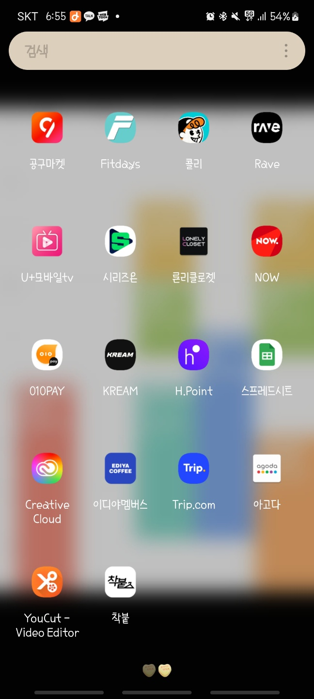

---

title: 배포 가이드

---
###### 0. 파일 준비하기
**step 1.** 저희 팀 [github](https://github.com/kookmin-sw/capstone-2023-08)로 이동합니다
<br>

**step 2.** Frontend-release 브랜치 코드를 다운로드 해주세요
<br>

**step 3.** 관리자가 제공하는 key.jks 파일, key.properties 파일이 필요합니다.
<br>

###### 1. key.jks 파일은 android/app/에, key.properties 파일은 android/에 붙여넣어줍니다
###### 2. 터미널에서 저희 프론트 루트 파일 위치로 이동합니다 (client 폴더)
```
ex) C:\Users\[nickname]\capstone-2023-08\client>
```

###### 3. 설치하고 싶은 기기를 usb로 연결합니다
###### 4. 다음 두가지 명령어를 입력합니다
```
flutter build apk
flutter install
```
###### 5. 기기 선택

제가 usb로 연결한 기기 이름은 SM M536S입니다. **flutter install**을 입력하고, 본인의 기기명을 찾아서 번호를 선택해주시면 됩니다
```
PS C:\Users\lucyy\merge_error\capstone-2023-08\client> flutter install
Multiple devices found:
SM M536S (mobile)            • Android 13 (API 33)
sdk gphone64 x86 64 (mobile) • Android 13 (API 33) (emulator)
Windows (desktop)            • Microsoft Windows
Chrome (web)                 • Google Chrome 113.0.5672.127
Edge (web)                   • Microsoft Edge 112.0.1722.48
[1]: SM M536S (RFCT50N6VYD)
[2]: sdk gphone64 x86 64 (emulator-5554)
[3]: Windows (windows)
[4]: Chrome (chrome)
[5]: Edge (edge)

Please choose one (To quit, press "q/Q"): 1
```
###### 6. 설치가 되면 이런 문구가 뜹니다
```
Installing app-release.apk to SM M536S...
Uninstalling old version...
Installing build\app\outputs\flutter-apk\app-release.apk...    19.4s
```
###### 7. 어플 로고가 나타납니다!

<div></div>
<br>
