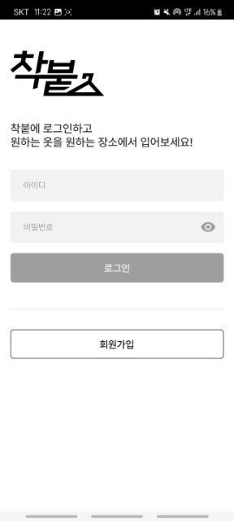
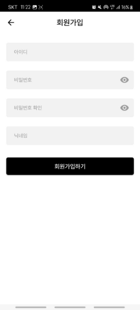
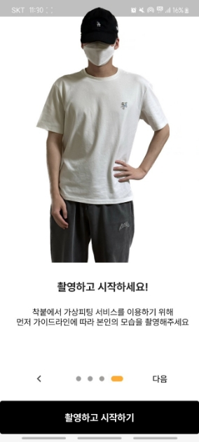

착붙은 가상피팅 어플로, 회원가입과 사진 촬영을 진행한 후, 서비스를 이용할 수 있습니다.  실제 사용 화면을 통해 착붙을 이용하는 방법을 알고 싶다면 아래 글에서 확인해주세요 
착붙을 다운로드하여 이용하는 방법은 [여기]()에 있습니다!

###### Step 1: 먼저 회원 가입을 해주세요!
 

 

###### Step 2: *회원가입 하기* 버튼을 누른 후 가이드 라인에 따라 *촬영하고 시작하기* 버튼을 눌러주세요!
 

  

 

###### Step 3: 제공되는 실루엣에 맞추어 촬영을 진행해주세요!
 

 

###### Step 4: 전부 완료하면 메인 화면으로 들어갑니다.
 

 

###### Step 5: 이제 *무신사 옷 입어보기* 나 *갤러리에서 옷 입어보기* 를 선택합니다.
 

  

 

###### Step 5-1: *무신사 옷 입어보기* 는 옷을 선택한 후 *피팅하기* 버튼을 눌러줍니다.

( *갤러리에서 옷 입어보기* 는 사진을 선택하면 바로 넘어갑니다.)
 

 

###### Step 6: 차분히 피팅페이지를 기다리면 결과를 받을 수 있습니다!
 

 

###### + 피팅 결과에 대한 피드백을 주시면 더 나은 결과를 받아보실 수 있어요!! ☺
 

 